# SQL Server on Azure VM → Microsoft Fabric ミラーリング + Azure Functions イベント駆動アラート

> 公式ドキュメント: <https://learn.microsoft.com/ja-jp/fabric/mirroring/sql-server-tutorial?tabs=sql2025>

このリポジトリは、**Azure VM 上の SQL Server 2022 → Fabric ミラーリング**（CDC ベース）を構築し、さらに
**Azure Functions SQL Trigger** によるイベント駆動の変更通知（SendGrid メール）を追加する手順書です。

---

## 0. ネットワーク構成

```
VNet: 10.30.0.0/16
├── sql-subnet:      10.30.1.0/24  (VM)
├── gateway-subnet:  10.30.2.0/24  (Fabric VNet Data Gateway)
└── func-subnet:     10.30.3.0/24  (Azure Functions VNet 統合)
```

---

## 1. 手順概要

| Step | 内容 |
| --- | --- |
| 1 | Azure VM (SQL Server 2022) + Azure Functions デプロイ |
| 2 | AdventureWorksLT2022 復元 |
| 3 | Fabric 用ログイン / ユーザー作成 |
| 4 | CDC 有効化（Fabric ミラーリング用） |
| 5 | Change Tracking 有効化（Functions SQL Trigger 用） |
| 6 | オンプレミス データ ゲートウェイのインストール |
| 7 | Fabric ワークスペース / Mirrored DB 作成 |
| 8 | SQL Server インスタンスへ接続 |
| 9 | ミラーリング開始（テーブル選択 → 実行） |
| 10 | OneLake / SQL 分析エンドポイントでデータ検証 |
| 11 | Azure Functions デプロイ（イベント駆動アラート） |
| 12 | 動作確認（データ変更 → メール通知） |

```mermaid
flowchart LR
    A[1. Azure VM + Functions デプロイ] --> B[2. AdventureWorksLT 復元]
    B --> C[3. fabric_login 作成]
    C --> D[4. CDC 有効化]
    D --> E[5. Change Tracking 有効化]
    E --> F[6. OPDG 登録]
    F --> G[7. Fabric Mirrored DB 作成]
    G --> H[8. SQL Server 接続]
    H --> I[9. ミラーリング開始]
    I --> J[10. SQL 分析EP 検証]
    J --> K[11. Functions デプロイ]
    K --> L[12. 動作確認]
```

---

## 2. 前提条件

| 項目 | 必要なもの |
| --- | --- |
| OS | Windows 10/11（操作端末） |
| Azure | サブスクリプション + リソース作成権限 |
| クライアント | Azure CLI / PowerShell 7 / VS Code MSSQL 拡張 / .NET 8 SDK |
| クラウド | Microsoft Fabric 容量（Trial 可）+ ワークスペース |
| メール通知 | SendGrid アカウント + API キー（Azure Marketplace 無料プランで可） |
| ネットワーク | Azure VM の SQL TCP ポートを操作端末 / Fabric から到達可能に（NSG） |
| Fabric テナント | サービス プリンシパル API 有効 / OneLake 外部アクセス有効 |

---

## 3. ステップ詳細

### Step 1. Azure リソースのデプロイ

`scripts/00-deploy-azure.ps1` を実行します。以下のリソースが一括デプロイされます:

- **Azure VM** (SQL Server 2022 Developer on Windows Server 2022)
- **VNet** (3 サブネット: sql / gateway / func)
- **NSG** (RDP + SQL from VNet)
- **Storage Account** (Functions 用)
- **Log Analytics + Application Insights** (Functions モニタリング)
- **Azure Functions** (Flex Consumption / .NET 8 isolated / VNet 統合)

```powershell
cd scripts

# (オプション) SendGrid 設定 — メール通知を有効化する場合
$env:SENDGRID_API_KEY = '<YOUR_SENDGRID_API_KEY>'
$env:ALERT_EMAIL_TO   = 'yourname@example.com'

./00-deploy-azure.ps1
```

デプロイ完了後に表示される接続情報:

```
接続情報:
  SQL Endpoint  : sqlmirror-xxxxx.japaneast.cloudapp.azure.com,1433
  Public IP     : 20.xx.xx.xx
  FQDN          : sqlmirror-xxxxx.japaneast.cloudapp.azure.com
  SQL Login     : fabric_login
  Functions App : sqlmirror-func-xxxxx
  Functions URL : https://sqlmirror-func-xxxxx.azurewebsites.net
  App Insights  : sqlmirror-ai
```

> 環境変数は `.azure-env.ps1` に保存され、後続スクリプトで自動読み込みされます。

---

### Step 2. AdventureWorksLT2022 を復元

```powershell
./02a-restore-adventureworkslt-azure.ps1
```

- `AdventureWorksLT2022.bak` を VM へ転送し `RESTORE DATABASE` を実行

---

### Step 3. Fabric 用ログイン / ユーザー作成

`scripts/03-fabric-login.sql` と `scripts/04-fabric-user.sql` を実行します。

```sql
-- 03-fabric-login.sql (master DB)
USE [master];
GO
IF NOT EXISTS (SELECT 1 FROM sys.server_principals WHERE name = 'fabric_login')
    CREATE LOGIN [fabric_login] WITH PASSWORD = 'F@bric_Strong_Pwd_2026';
GO
```

```sql
-- 04-fabric-user.sql (AdventureWorksLT2022 DB)
USE [AdventureWorksLT2022];
GO
IF NOT EXISTS (SELECT 1 FROM sys.database_principals WHERE name = 'fabric_user')
    CREATE USER [fabric_user] FOR LOGIN [fabric_login];
GO
ALTER ROLE db_owner ADD MEMBER [fabric_user];
GO
```

---

### Step 4. CDC を有効化（Fabric ミラーリング用）

`scripts/05-enable-cdc.sql` を `AdventureWorksLT2022` に対して実行します。

```sql
USE [AdventureWorksLT2022];
GO
EXEC sys.sp_cdc_enable_db;
GO
-- SalesLT スキーマの全テーブルで CDC を有効化
-- Fabric ミラーリング要件: @supports_net_changes = 1 必須
```

> ⚠️ `@supports_net_changes = 0` で有効化すると Fabric ミラーリングがエラーになります。
> 修正が必要な場合は `scripts/05b-fix-cdc-net-changes.sql` を使用してください。

---

### Step 5. Change Tracking を有効化（Azure Functions SQL Trigger 用）

Azure Functions の SQL Trigger は **Change Tracking** を使用します。
CDC（Fabric ミラーリング用）とは独立した機能であり、同一テーブルに両方有効化しても問題ありません。

`scripts/07-enable-change-tracking.sql` を実行します。

```sql
-- DB レベルで Change Tracking を有効化
ALTER DATABASE [AdventureWorksLT2022]
    SET CHANGE_TRACKING = ON
    (CHANGE_RETENTION = 2 DAYS, AUTO_CLEANUP = ON);

-- テーブルレベルで有効化（カーソルで SalesLT スキーマ全テーブルを一括処理）
ALTER TABLE [SalesLT].[SalesOrderHeader]
    ENABLE CHANGE_TRACKING WITH (TRACK_COLUMNS_UPDATED = ON);
```

検証:

```sql
-- Change Tracking が有効なテーブル一覧
SELECT OBJECT_SCHEMA_NAME(object_id) AS [Schema],
       OBJECT_NAME(object_id) AS [Table],
       min_valid_version, begin_version
FROM sys.change_tracking_tables;
```

> 💡 **CDC と Change Tracking の違い**:
> | 機能 | CDC | Change Tracking |
> |---|---|---|
> | 用途 | Fabric ミラーリング | Azure Functions SQL Trigger |
> | 記録内容 | 変更前後の行データ全体 | 変更された行の PK のみ |
> | 依存 | SQL Server Agent 必須 | Agent 不要 |
> | 共存 | 可能 | 可能 |

---

### Step 6. オンプレミス データ ゲートウェイをインストール

VM 上にゲートウェイを登録します。

> ⚠️ Fabric テナントのリージョンと一致するゲートウェイ リージョンを選ぶこと。

参考: `scripts/_install-opdg.ps1`, `scripts/_register-opdg.ps1`

---

### Step 7. Fabric でミラー化された SQL Server データベースを作成

1. <https://fabric.microsoft.com> を開く
2. 対象のワークスペースに移動
3. **+ 新しい項目** → `Mirror` で検索 → **Mirrored SQL Server database** を選択
4. 名前: **`AdventureWorksLT2022`**
5. **作成** をクリック

**7-1. ワークスペース作成済み**

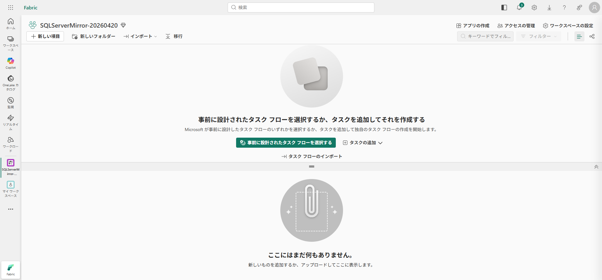

**7-2. ワークスペース概要**

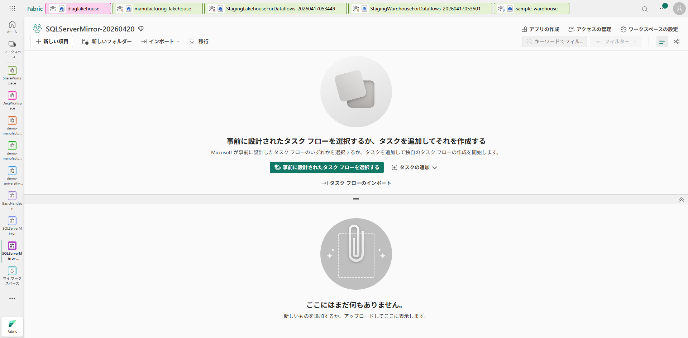

**7-3. 新しい項目 → Mirror 検索**

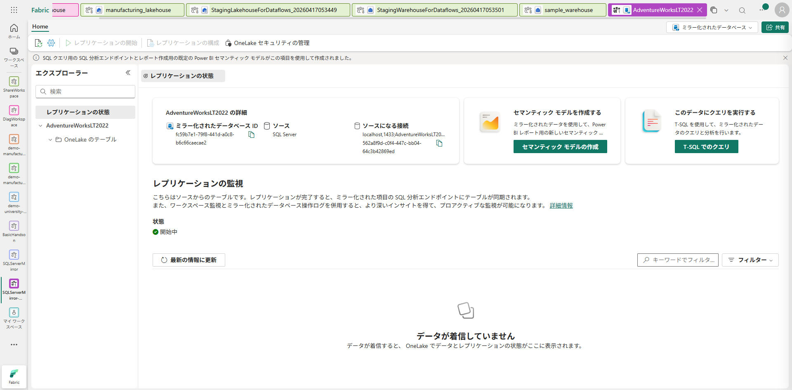

**7-4. Mirror 作成ダイアログ（読み込み）**

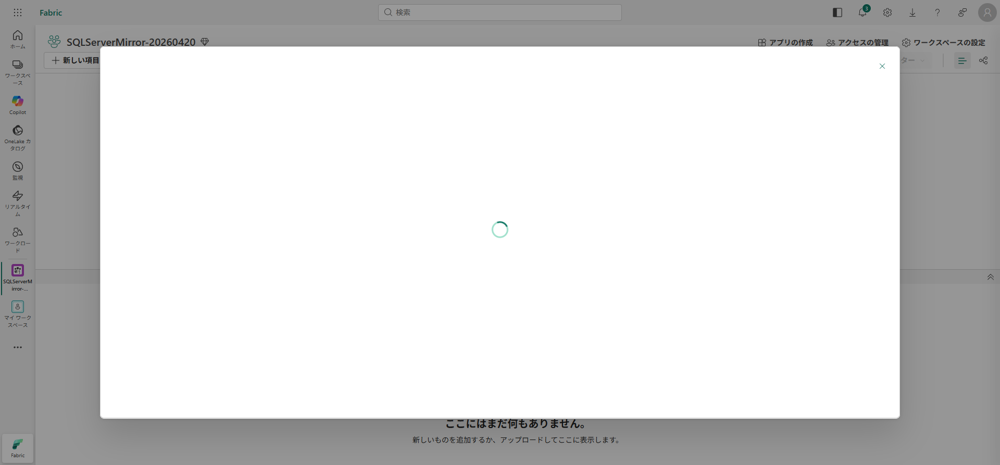

**7-5. Mirror 作成ダイアログ**

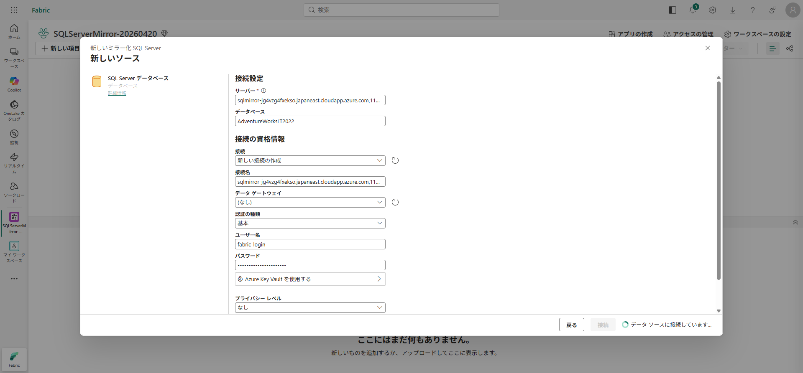

**7-6. 名前を AdventureWorksLT2022 に**

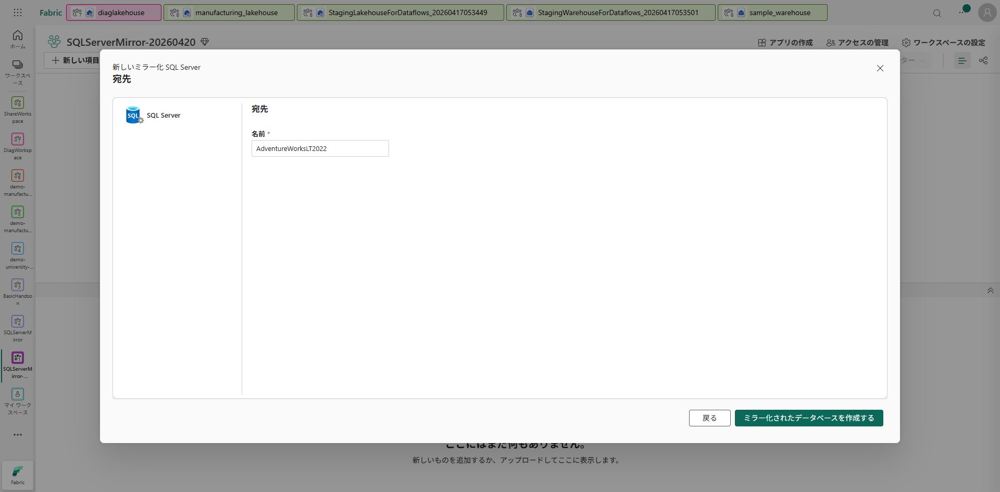

---

### Step 8. SQL Server インスタンスへ接続

接続情報を入力します:

- **サーバー**: `<VMのFQDN>,1433`
- **データベース**: `AdventureWorksLT2022`
- **データ ゲートウェイ**: `[オンプレミス] <ゲートウェイ名>`
- **認証の種類**: `基本`
- **ユーザー名**: `fabric_login`
- ✅ **暗号化された接続を使用する**

**8-1. 接続フォーム（空）**

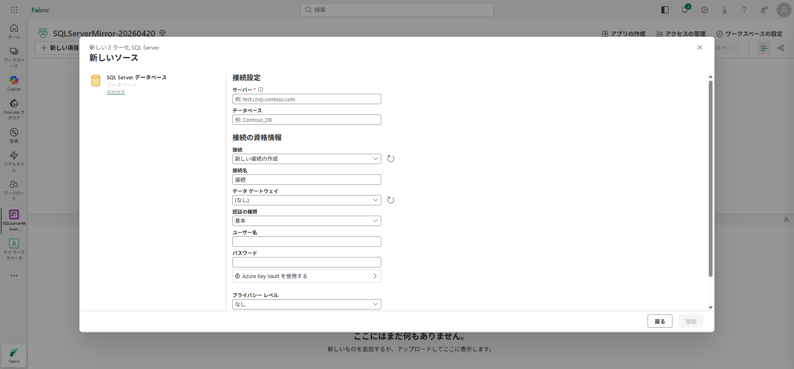

**8-2. サーバー / DB / 資格情報 入力済**

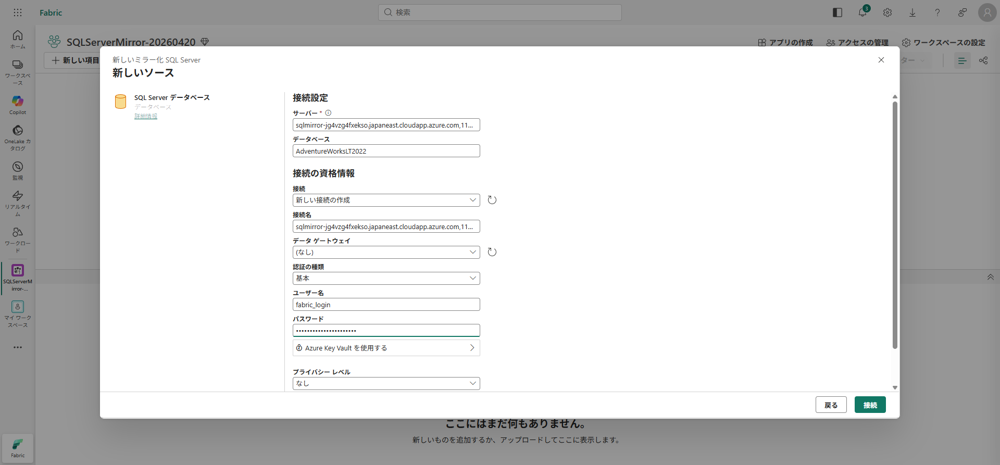

**8-3. ゲートウェイ ドロップダウンでオンプレミス ゲートウェイを選択**

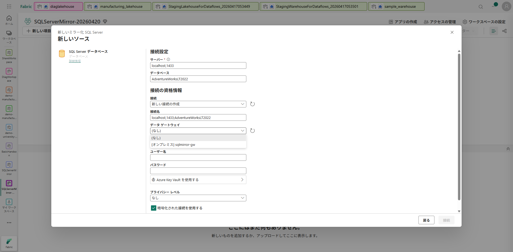

**8-4. 全項目入力完了 → 接続**

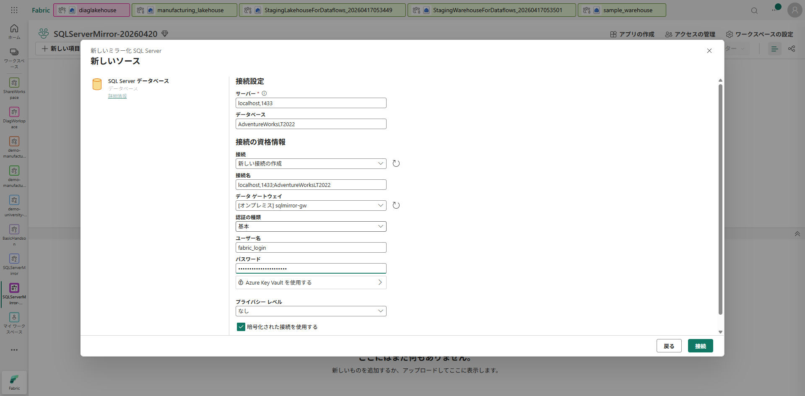

> ⚠️ ゲートウェイなしで接続すると以下のようなエラーになります。必ずオンプレミス データ ゲートウェイを選択してください。

**参考: ゲートウェイ未指定時のエラー例**

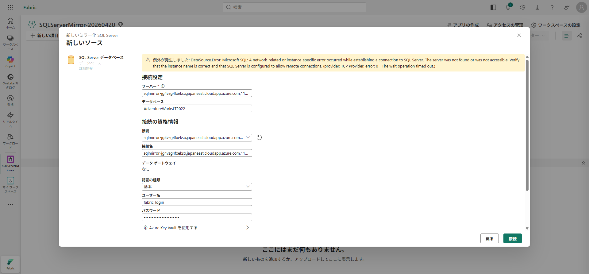

---

### Step 9. ミラーリング開始

1. テーブル選択画面で対象テーブルを選択
2. **接続** → **ミラー化されたデータベースを作成する**
3. レプリケーションの状態が **✅ 実行中** になれば成功

**9-1. テーブル選択**

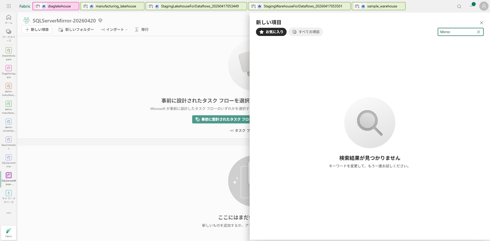

**9-2. 全テーブル「実行中」**

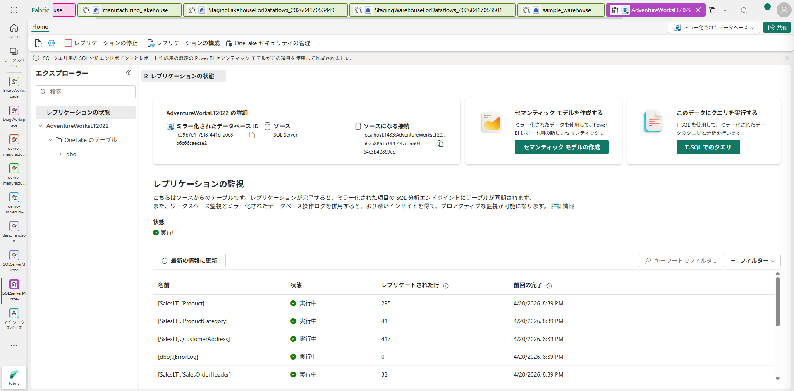

---

### Step 10. OneLake / SQL 分析エンドポイントでデータ検証

1. ワークスペース → **SQL 分析エンドポイント** `AdventureWorksLT2022` を開く
2. 検証クエリを実行:

```sql
SELECT TOP 100 * FROM SalesLT.Customer;
SELECT COUNT(*) AS TotalRows FROM SalesLT.SalesOrderHeader;
```

3. ソース DB と行数が一致していることを確認 → **ミラーリング成功**

**10-1. ワークスペース項目一覧（ミラー DB + SQL 分析エンドポイント）**

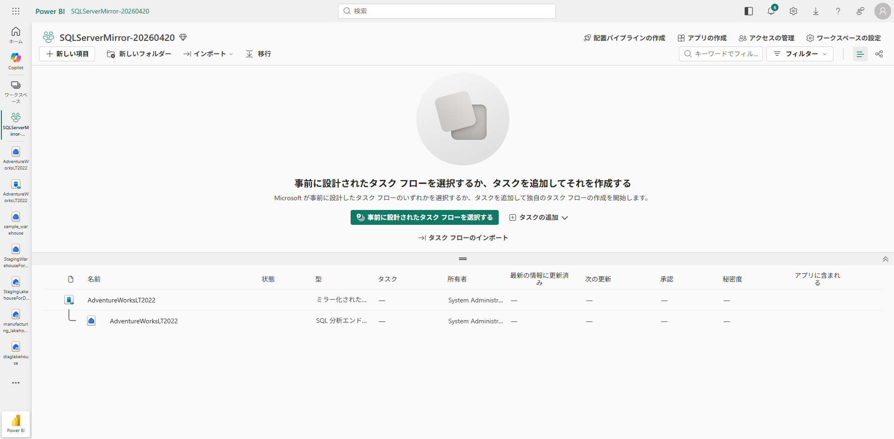

**10-2. SQL 分析エンドポイント概要（SalesLT スキーマ確認）**

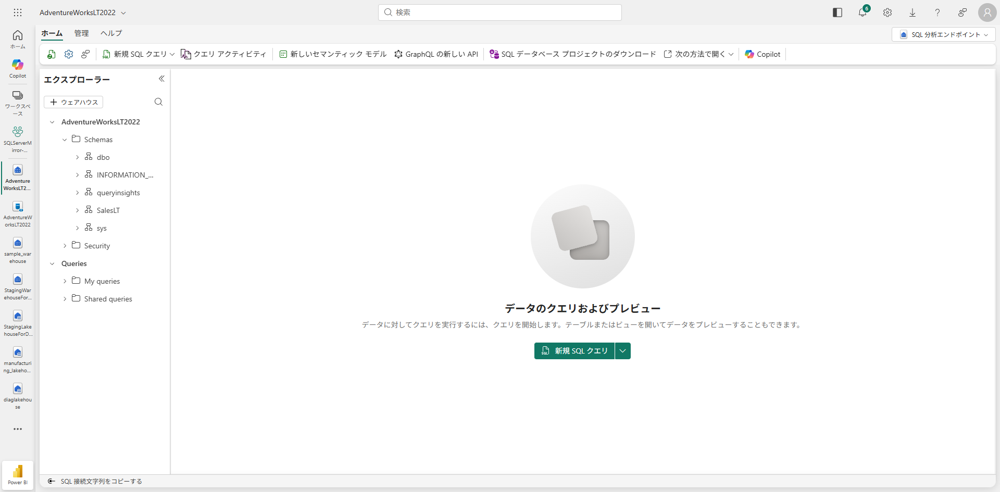

**10-3. Customer クエリ入力**

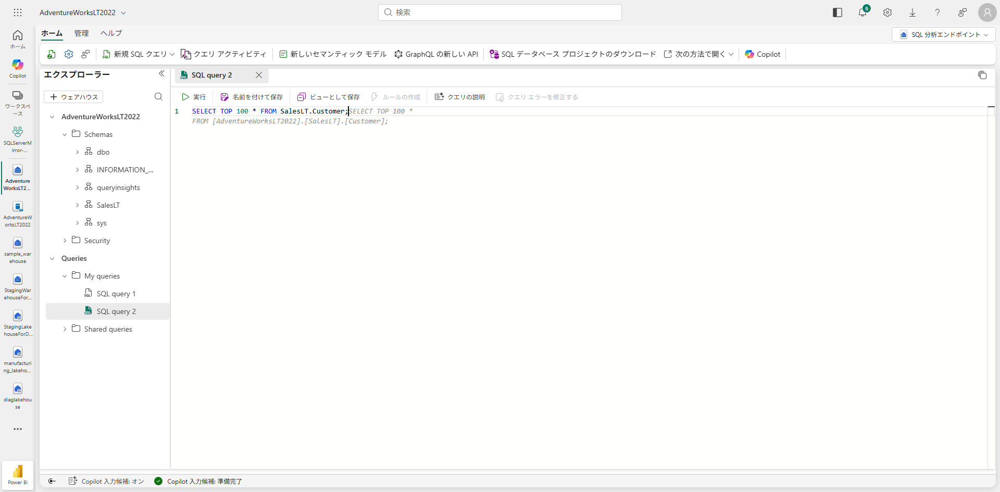

**10-4. Customer クエリ結果**

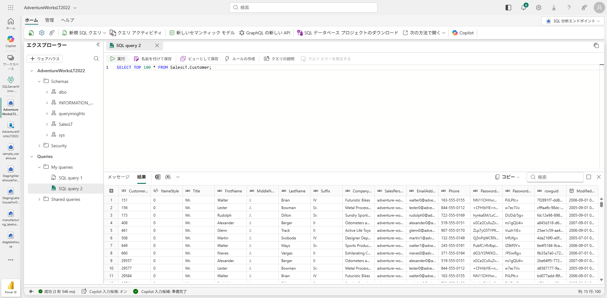

**10-5. SalesOrderHeader クエリ成功**

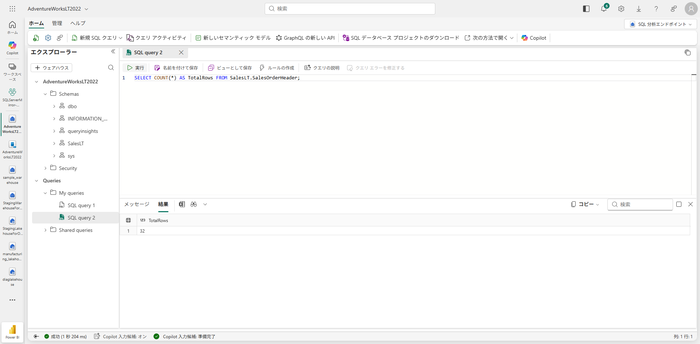

**10-6. レプリケーション状態**

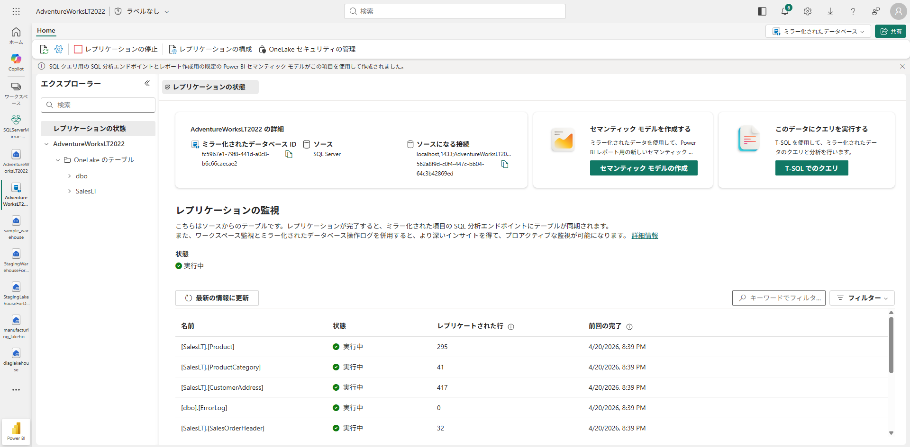

---

### Step 11. Azure Functions デプロイ（イベント駆動アラート）

Step 1 で Functions App のインフラ（Flex Consumption プラン、VNet 統合、App Settings）は
デプロイ済みです。ここではアプリケーション コードをデプロイします。

#### 11-1. Functions プロジェクト構成

```
functions/
├── SqlMirrorAlert.csproj        … .NET 8 isolated worker プロジェクト
├── Program.cs                   … ホスト設定
├── SalesOrderChangeTrigger.cs   … SQL Trigger 関数（メイン）
├── host.json                    … Functions ランタイム設定
└── local.settings.json          … ローカルデバッグ用設定
```

#### 11-2. SQL Trigger 関数のポイント

```csharp
[Function(nameof(SalesOrderChangeTrigger))]
public async Task Run(
    [SqlTrigger("[SalesLT].[SalesOrderHeader]", "SqlConnectionString")]
    IReadOnlyList<SqlChange<SalesOrderHeader>> changes)
{
    // changes には INSERT / UPDATE / DELETE された行が含まれる
    foreach (var change in changes)
    {
        _logger.LogInformation(
            "Operation={Operation}, SalesOrderID={Id}",
            change.Operation, change.Item.SalesOrderID);
    }

    // SendGrid でメール通知を送信
    // ...
}
```

- **`SqlTrigger`**: Change Tracking を約 1 秒間隔でポーリングし、変更を検知したら関数を起動
- **`SqlChange<T>`**: 変更操作（Insert / Update / Delete）と変更後の行データを保持
- ユーザー視点ではイベント駆動（Activator の 5-15 分間隔と比べはるかに高速）

#### 11-3. デプロイ実行

```powershell
# .NET 8 SDK が必要
./08-deploy-functions.ps1
```

デプロイ完了後:

```
✅ Functions デプロイ完了
  App Name : sqlmirror-func-xxxxx
  URL      : https://sqlmirror-func-xxxxx.azurewebsites.net
```

#### 11-4. Application Insights で確認

Azure Portal → Application Insights (`sqlmirror-ai`) → **ライブ メトリック** を開き、
SQL Trigger が正常にポーリングを開始していることを確認します。

---

### Step 12. 動作確認（データ変更 → メール通知）

#### 12-1. ソース SQL Server でデータを変更

```sql
-- ソース SQL Server (AdventureWorksLT2022) で実行
INSERT INTO SalesLT.SalesOrderHeader
    (RevisionNumber, OrderDate, DueDate, ShipDate, Status,
     OnlineOrderFlag, CustomerID, ShipMethod, SubTotal, TaxAmt, Freight)
VALUES
    (1, GETDATE(), DATEADD(DAY, 7, GETDATE()), NULL, 1,
     1, 29825, 'CARGO TRANSPORT 5', 100.00, 8.00, 2.50);
```

#### 12-2. イベントの流れ

```
1. SQL Server: SalesOrderHeader に行が INSERT される
2. Change Tracking: 変更を記録（即時）
3. Azure Functions SQL Trigger: ~1 秒以内に変更を検知、関数起動
4. SendGrid: メール送信
5. 受信者: メール受信（件名: [SQL Mirror Alert] 1 change(s) detected ...）
```

同時に:
```
1. CDC: 変更ログをキャプチャ
2. Fabric ミラーリング: 差分を OneLake にレプリケート（数秒〜数分）
3. SQL 分析エンドポイント: クエリで新しい行を確認可能
```

#### 12-3. 確認ポイント

| 確認項目 | 確認方法 |
| --- | --- |
| Functions が変更を検知したか | Application Insights → ログ検索: `SQL Trigger fired` |
| メールが届いたか | SendGrid Activity Feed or 受信トレイ |
| Fabric にも反映されたか | SQL 分析EP: `SELECT COUNT(*) FROM SalesLT.SalesOrderHeader` |

---

## 4. 後片付け

```powershell
# Azure リソース削除（VM + Functions + Storage + App Insights すべて）
az group delete -n rg-sqlmirror-demo --yes --no-wait
```

Fabric 側ではミラー化されたデータベース / ワークスペースを削除すれば OneLake からも削除されます。

---

## 5. トラブルシューティング

| 症状 | 対処 |
| --- | --- |
| ゲートウェイ ドロップダウンに出てこない | ゲートウェイのリージョンと Fabric 容量のリージョンを揃える |
| Fabric から VM に接続できない | NSG で SQL ポートを許可、SQL の TCP/IP を有効化 |
| `fabric_login` で認証失敗 | SQL Server 認証モードを「混合」にし再起動 |
| ミラーリングが Running にならない | CDC が有効か、`fabric_user` が `db_owner` か確認 |
| `net_change flag not enabled ...` | CDC を `@supports_net_changes = 1` で re-enable |
| SQL Trigger が発火しない | Change Tracking が有効か確認 (`sys.change_tracking_tables`) |
| Functions から SQL Server に接続できない | VNet 統合が有効か、func-subnet の delegation を確認 |
| SendGrid メールが届かない | SendGrid API キーが正しいか、Activity Feed でエラー確認 |
| Application Insights にログが出ない | `APPLICATIONINSIGHTS_CONNECTION_STRING` が設定されているか確認 |

---

## 6. 参考リンク

- [チュートリアル: SQL Server から Fabric ミラーリング](https://learn.microsoft.com/ja-jp/fabric/mirroring/sql-server-tutorial?tabs=sql2025)
- [Azure Functions SQL bindings — SQL Trigger](https://learn.microsoft.com/en-us/azure/azure-functions/functions-bindings-azure-sql-trigger)
- [SQL Server Change Tracking](https://learn.microsoft.com/en-us/sql/relational-databases/track-changes/about-change-tracking-sql-server)
- [Fabric ミラーリングの概要](https://learn.microsoft.com/ja-jp/fabric/mirroring/overview)
- [オンプレミス データ ゲートウェイ](https://learn.microsoft.com/ja-jp/data-integration/gateway/service-gateway-install)
- [SendGrid on Azure](https://learn.microsoft.com/en-us/azure/sendgrid-dotnet-how-to-send-email)
